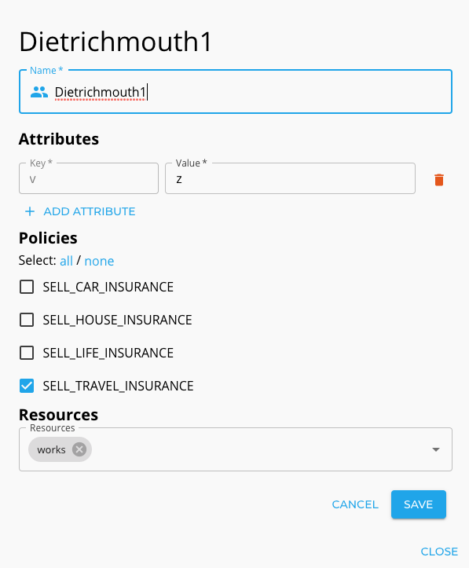

# In-depth view on managing policies in groups
A user of a group can be assigned any policy that is available in the group.
DABP allows you to create subgroups of any group. Policies in the subgroup are restricted by the parent group.
That means that a subgroup cannot have more policies assigned than its direct parent group.

## Managing policies in the group
To add/remove a policy to a group you should select the group that you want to assign policies to on the group list screen.
After clicking on the desired group a modal window with group information will appear. Click on the vertical ellipsis button and select `Edit group`.
Now you can select which policies can be assigned to the group.

After selecting the required policies click save to confirm your choice.

## How managing policies on a group level affects subgroup policies.
Policies that can be assigned to a subgroup are restricted by the parent group. That means you can create a subgroup and assign to it only those policies that are present in the parent group.
Adding a policy to a group does not assign it to the subgroups, it only makes the policy available for those groups. 
You can edit the subgroups and add the new policy if needed.
Adding a policy to a group does not assign it to the group members, it only makes the policy available for them. 
You can edit members of the group to link him with the new policy.
Removing a policy from a group automatically removes it from all subgroups and all users in the group and all subgroups.

