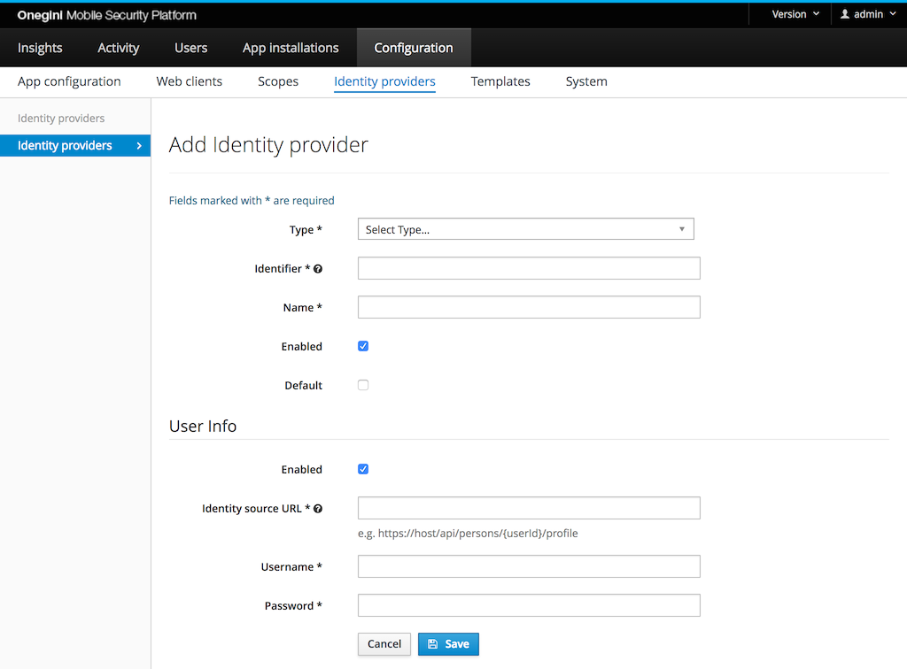
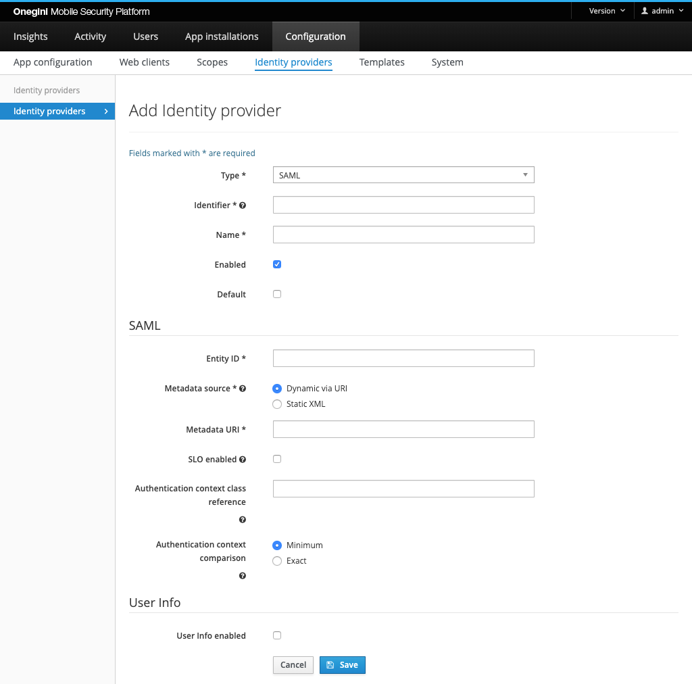
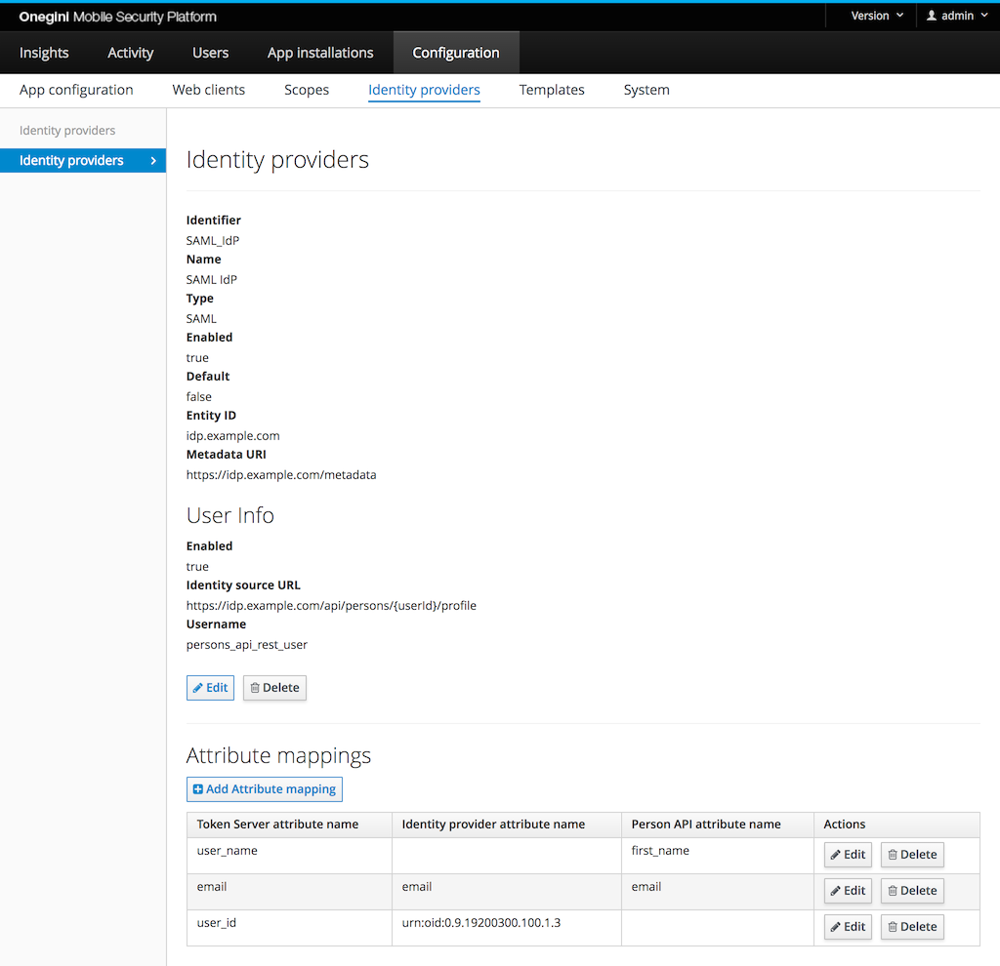
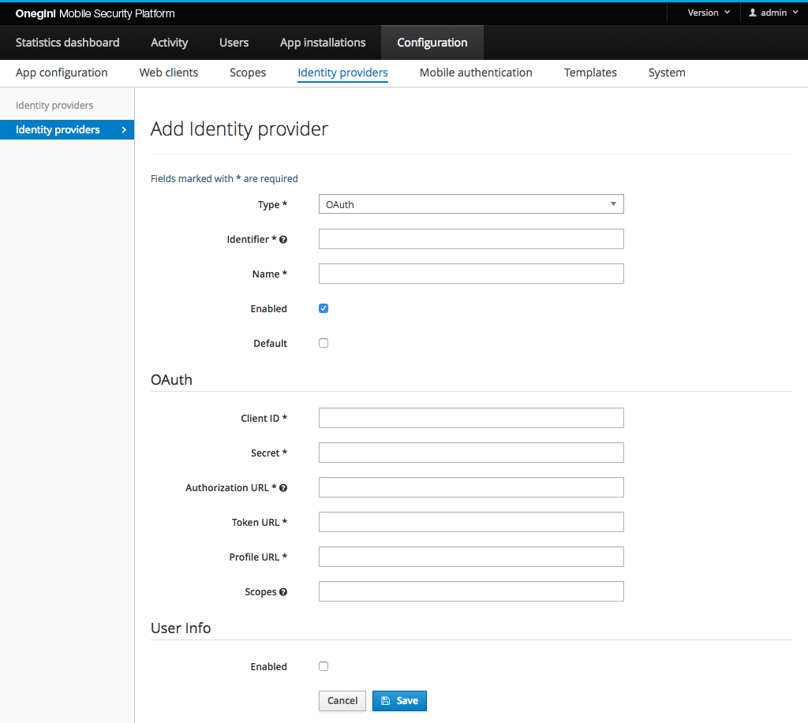
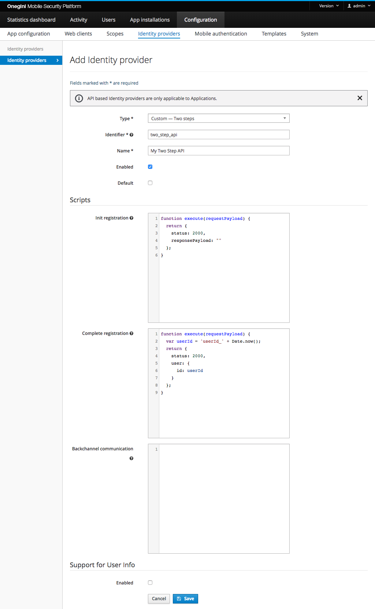
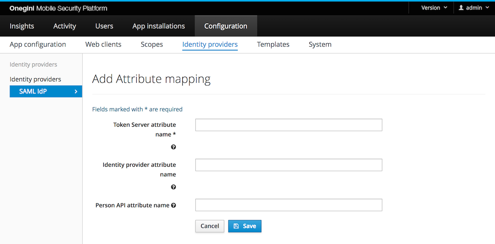

# Identity provider configuration

Onegini Access has no user management. Onegini Access depends on external identity providers (IdP) to identify a user. Onegini Access supports multiple 
integrations with identity providers out of the box. Custom integrations are also supported.

Go to `Configuration` and then to `Identity providers` to configure identity providers in the admin console.

## General configuration



The following properties can be set for each type of identity provider:

* Type: the type of this identity provider. The type can only be changed later from a generic SAML to a Onegini CIM identity provider.
* Identifier: the id of the identity provider. This uniquely identifies the IdP and cannot be changed later.
* Name: a human readable name of the identity provider. This name is not shown to the end user, only to administrators.
* Default: an identity provider can be assigned to an application. When no identity provider is specified for an application, the default identity provider is used.
* Enabled: flag to enable/disable this identity provider.

Additionally, for those identity providers that expose identity via API, it is possible make Onegini Access aware of this API.
See [Configure User Info endpoint](#configure-user-info-endpoint) for further details.

## Configure a Onegini CIM Identity Provider

The Onegini CIM Identity Provider is meant to connect with the Onegini [Consumer Identity Manager](https://docs-single-tenant.onegini.com/cim/stable/idp) (CIM) 
IDP. It makes features like [OpenID Connect](../../oidc/index.md) easily configurable and exposes new features like [App to Web SSO](../../app-to-web/index.md). 
It is configured in much the same way as a [SAML Identity Provider](#configure-a-saml-identity-provider).


Depending on which integration(s) are enabled, the configuration requirements change. See the table below for information:

| Field                           | Example                         | Required For Integration(s) | Description 
|---------------------------------|---------------------------------|-----------------------------|-------------------------------------------------------------------------------
| API Base Uri                    | `https://internal.example.com`  | All                         | The API base uri of the CIM IDP.
| Public Base Uri                 | `https://public.example.com`    | App To Web                  | The public facing base uri of the CIM IDP (possibly the same as the API base uri).
| Person API Username             | `person_api_username`           | User Info or App to Web     | The username of the Person API.
| Person API Password             | `password`                      | User Info or App to Web     | The password of the Person API.
| Persons Partitioning Identifier | `examplePartition`              | Not required                | This value will be sent along with the Person API call. It should only be set when [persons partitioning](https://docs-single-tenant.onegini.com/cim/stable/idp/topic-guides/persons-partitioning.html) is enabled in CIM.
| Storage API Username            | `storage_api_username`          | Storage API                 | The username of the Storage API.
| Storage API Password            | `password`                      | Storage API                 | The password of the Storage API.
| Configuration API Username      | `configuration_api_username`    | Configuration API           | The username of the Configuration API.
| Configuration API Password      | `password`                      | Configuration API           | The password of the Configuration API.

In order to ensure backwards compatibility between the Access and dependent services that rely on the `sub` claim returned as part of the JWT or the ID Token,
configure to use the external identity as an account identifier. Please refer
to [general system configuration page documentation](../../technical-app-management/general-config/general-config.md) for more details.

## Configure a SAML Identity Provider



By default, the endpoints required for SAML in Onegini Access are disabled. These endpoints should be enabled via [SAML Service Provider Configuration `SAML Service Provider enabled`](../../technical-app-management/idp-saml-sp-config/idp-saml-sp-config.md#saml-enabled)
to use the SAML IdP integration.

When the SAML IdP functionality is used Onegini Access acts as a SAML service provider. The metadata of the service provider can be configured via 
[SAML Service Provider Configuration](../../technical-app-management/idp-saml-sp-config/idp-saml-sp-config.md). In the SAML IdP Onegini Access has to be configured as service 
provider. Please refer to [Configuring the Metadata of the SAML Service Provider](../../technical-app-management/idp-saml-sp-config/idp-saml-sp-config.md#configure-metadata-of-the-saml-service-provider)
for more information.

The Entity ID must be configured in Onegini Access for a SAML IdP. The Entity ID in the configuration of Onegini Access should be equal to the Entity ID in the 
metadata of the IdP.

There are two options to specify the IdP metadata:

1. 'Dynamic via URI' - the metadata is automatically fetched from provided url - typically Saml Identity Provider. This is the recommended option as the refresh of the metadata is handled automatically. 
2. 'Static XML' - the complete XML representing Saml metadata is provided directly as a static text. When using this option make sure that metadata has sufficient expiry date and keys within the metadata are up-to-date.
 
Onegini Access supports multiple certificates in the metadata in order to migrate to a new certificate smoothly.

Onegini Access supports IdP initiated SAML Single Logout (SLO). By enabling SLO, the IdP is able to terminate sessions at Onegini Access. This means that 
when a user logs out at the identity provider, Onegini Access will receive a request to revoke all access tokens and grants associated with that session.
This feature is only available for web clients that do not make use of refresh tokens.

Onegini Access can choose requested authentication context class reference which then will be used with all SAML requests. If none is specified it defaults to 
`urn:oasis:names:tc:SAML:2.0:ac:classes:PasswordProtectedTransport`

The SAML Authentication context comparison tells the identity provider how should it compare the requested authentication context to supported ones.

>**Note:** The SLO enabled checkbox is available in the form if and only the [SAML Service Provider Configuration `SLO enabled`](../../technical-app-management/idp-saml-sp-config/idp-saml-sp-config.md#slo-enabled) is enabled.
 
By default only the user id of the user is mapped based on the name id available in the SAML assertion. By adding an attribute mapping more user attributes
from the SAML assertion can be used. When creating an attribute mapping both the `Name` or `FriendlyName` of a SAML attribute can be used. Example:



Onegini Access supports free format attribute names. All attributes (including the non default ones) are available in the token introspection response and in 
the consent template. A set of default attributes is available that can lead to different behavior in Onegini Access:

* userId
* authenticationLevel
* firstName
* lastName
* email
* phoneNumber
* languageCode

## Configure an OAuth Identity Provider



Onegini Access can act as an OAuth client for an identity provider that acts as an OAuth authorization server. Onegini Access then uses the OAuth 
[authorization code flow](https://tools.ietf.org/html/rfc6749#page-24) to obtain an access token and uses that access token to get user information.

The following properties can or must be set for the OAuth Identity Provider:

| Property             | Example                             | Required | Description 
|----------------------|-------------------------------------|----------|-------------
| Client ID            | jeguighreuwih8792459uht893          | Yes      | The identifier for Onegini Access in the OAuth IdP. 
| Secret               | fjerfr9uf089rf908f90refeef          | Yes      | The secret for Onegini Access in the OAuth IdP. 
| Authorization URL    | https://example.com/oauth/authorize | Yes      | URL to start the authorization without request parameters. These are added by Onegini Access.
| Token URL            | https://example.com/oauth/token     | Yes      | URL to exchange the access grant for an access token without request parameters. These are added by Onegini Access. The URL is called via HTTP POST. The client id and secret are sent via the HTTP Authorization header (Basic authentication) or via the url encoded form.
| Profile URL          | https://example.com/me              | Yes      | URL for an OAuth resource call that returns a user profile. The URL is called via HTTP POST. The access token is sent via the HTTP Authorization header with a [Bearer token](https://tools.ietf.org/html/rfc6750#section-2.1).
| Scopes               | profile                             | No       | Scopes that are needed for getting the user profile. Multiple scopes must be separated by a space. An empty value is allowed.


During the OAuth authorization flow the user is redirected back from the OAuth IdP to the Onegini Access. This redirect URL is the engine base URI + the engine 
context root + `/oauth-idp/callback`.
Example: `https://token-server.example.com/oauth/oauth-idp/callback`.

Attribute mappings are currently not supported in this IdP. The Onegini Access expects the profile in the following structure to extract the user identifier:

```json
{
  "userId" : "user-1234"
}
```

## Configure a Custom API Identity Provider

Custom API Identity Providers can be either `One Step` or `Two Step`. These Identity Providers utilize the Onegini Extension Engine to execute custom JavaScript to 
validate the registration. Scripts should be supplied when configuring this Identity Provider. `Two Step` requires an `Init registration` and 
`Complete registration` script while `One Step` only requires a `Complete registration ` script. Both can have an optional script for 
`Backchannel communication`, but that is not required. 




For more information on the Identity Provider refer to the [Custom Registration topic guide](../../custom-registration/index.md).

See the [Example Scripts](../../custom-registration/custom-api-example.md) for help to create the scripts.

## Configure a Onegini CIM API Identity Provider

The Onegini CIM API Identity Provider combines the flexibility of the Custom API Identity Provider with out-of-the-box integrations of Onegini CIM. The user 
registration flow is handled via scripts to fully customize the look and feel in the mobile app. After the user has registered, existing integrations like [App
to Web Single Sign On](../../app-to-web/index.md) can be called from the Onegini Mobile SDK.

## Configure User Info endpoint

For any type of the Identity Provider it is possible to configure an endpoint which Onegini Access will use as a source of user identity attributes. It is used
by Onegini Access to expose UserInfo and populate ID Token with claims in OpenID Connect flows. This endpoint needs to be compliant with 
[Person API](https://docs-single-tenant.onegini.com/cim/stable/idp/api-reference/person-api.html). 
The reference implementation of this API is provided by CIM. Refer to CIM documentation for API specification and instructions how to enable it.

* Enabled: indicates whether identity attributes may be retrieved via API
* Identity source URL: Url of the Person API compliant endpoint
* Username: username that shall be used when accessing API
* Password: password that shall be used when accessing API

The calls to the API are cached. The TTL of this cache can be configured as described in [Cache Configuration](../../technical-app-management/cache-config/cache-config.md)

## Attribute mapping



### Identity Provider attributes
Some identity providers are capable of providing user attributes during authorization. These attributes are associated with respective access tokens and
are available as a key-value pair for an inspection via the [Token introspection API](../../../api-reference/token-introspection.md).

By default, the attributes are stored under the original keys, but it is possible to override that behaviour by defining a custom mapping. 
If at least one custom mapping is defined, only those attributes will be mapped. That means other attributes that are not mapped will be dropped. If you are 
using [SAML attribute name mapping](https://docs-single-tenant.onegini.com/cim/stable/idp/administration/configure-attributes.html) in 
Onegini CIM, make sure to coordinate the configuration between the two products. The attribute names are case-sensitive.

A special user attribute is the user identifier. It identifies the user within the Onegini Access. For a SAML based identity provider the assertion 
`Subject/NameID` is the standard user identifier. Create an attribute that maps to `userId` if you need to use a different attribute as user identifier. 

### Person API attributes
The attributes are stored during authorization, but the Onegini Access will not resynchronize them later. This results in potentially stale data. 
To overcome this limitation, consider leveraging the [Person API integration](#configure-user-info-endpoint).

If the Person API integration is enabled, the Token introspection API returns all non-empty attributes from the Person API, in addition to the attributes that 
were returned during the authorization.

Supported attributes are:

- `first_name`
- `last_name`
- `gender`
- `birth_date`
- `locale`
- `email`
- `email_verified`
- `phone_number`
- `phone_number_verified`
- `street_name`
- `house_number`
- `house_number_addition`
- `city`
- `region`
- `country`
- `postal_code`

Similar to attributes provided by an identity provider, the names of attributes as returned by the Token Introspection API 
can be changed by defining a custom mapping. If at least one custom mapping is defined, only those attributes that are configured are mapped.
Name of the attributes are case-sensitive.
