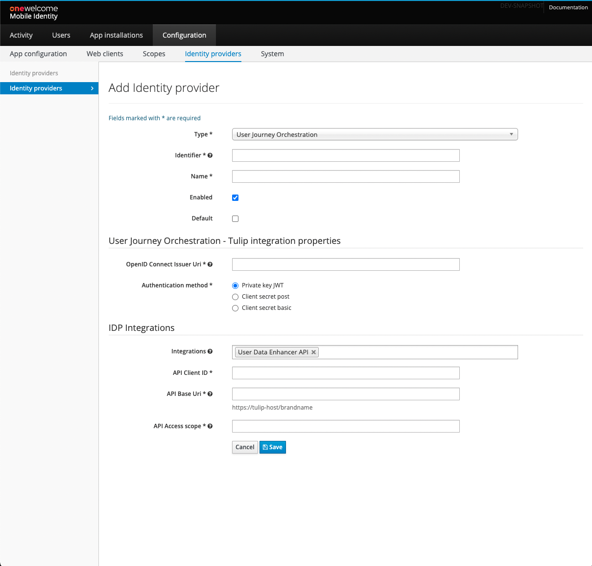

# UJO Integration

"UJO" stands for User Journey Orchestration and, as such, represents an Access capability that enables external Relying Parties (RPs) to
authenticate their users in a customizable and extendable way. When integration is configured and enabled, Access will feed UJO with
contextual information about the state of an active session, as well as all other information that can be derived from the original request
sent by the RP. Based on the presented information and the capabilities configured for a given tenant, UJO decides how the authentication
process should be handled (i.e., which authentication process to execute).

## Configuring UJO integration

To configure UJO integration, navigate to the `Configuration` tab of the administration console and click the `Identity Providers`tab.
On the overview that is shown, you can select the `Add Identity Provider` option.

Fill all the mandatory fields.

| Field                     | Required | Example value                                                   | Details                                                                                                                                                                       |
|---------------------------|----------|-----------------------------------------------------------------|-------------------------------------------------------------------------------------------------------------------------------------------------------------------------------|
| Type                      | yes      | User Journey Orchestration                                      | The integration type, for UJO must be set to `User Journey Orchestration`.                                                                                                    |
| Name                      | yes      | UJO                                                             | Display name of this UJO Identity Provider instance. This is only used for informational purposes in the Admin console and APIs.                                              |
| Identifier                | yes      | ujo                                                             | Unique identifier of this UJO Identity Provider.                                                                                                                              |
| Enabled                   | no       |                                                                 | Indicates whether the Identity Provider integration being configured is enabled (can be references by Web and Mobile Clients).                                                |
| Default                   | no       |                                                                 | Indicates whether the Identity Provider integration being configured is default - will be used by all Web and Mobile Clients that don't specify a specific Identity Provider. |
| OpenID Connect Issuer Uri | yes      | https://insurgroup-edge.onewelcome.io/insurcar/auth/oauth2.0/v1 | OIDC Issuer URI of Tulip instance that is meant to serve as a User Store for this UJO integration.                                                                            |
| Authentication method     | yes      | Private key JWT                                                 | Client authentication scheme that will be used by Access when communicating with Tulip and UDH APIs.                                                                          |
| Integrations              | yes      | User Data Enhancer API                                          | UJO integration requires UDH, a primary data source for the user.                                                                                                             |
| API Client ID             | yes      | udh-client                                                      | The OAuth client identifier that will be used to obtain an AccessToken for the UDH communication.                                                                             |
| API Base Uri              | yes      | https://insurgroup-edge.onewelcome.io/insurcar                  | The Tulip's base URL including segment path element.                                                                                                                          |
| API Access scope          | yes      | iwelcome:segment:intergroup                                     | OAuth scope required by the UDH integration.                                                                                                                                  |
