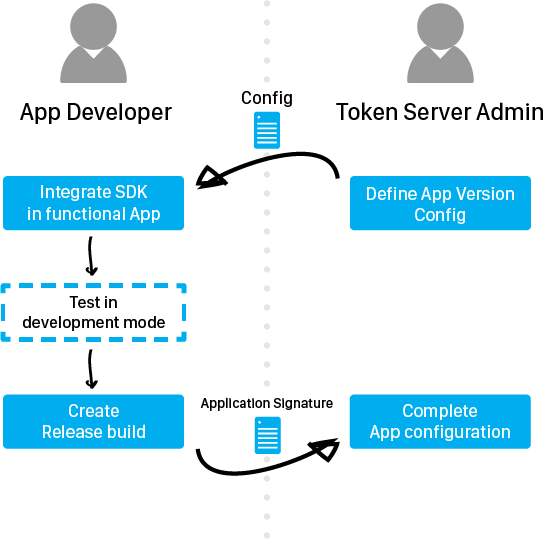

# Mobile application delivery lifecycle

The configuration and deployment of a new application release is a process where both the application developer and a Onegini Access administrator are involved.
To enable an application using the SDK to communicate with Onegini Access. It has to be configured in Onegini Access. Therefore, the application developer
should know which configuration settings to use in the application that he is building. To simplify things for the application developer the Onegini Access
administrator can prepare and export the application configuration in Onegini Access. This configuration is exported as a zip archive which can be used in the
SDK tooling to generate the required code and config files.

## Application version configuration

An administrator can export the application config via the export button next to an application version in the application view. Downloading a zip file,
containing all required information for the SDK, will be initialized when clicking this button. The Onegini Access administrator is responsible for shipping the
zip archive to the application developer.

The configuration which can be exported contains multiple elements. The paragraphs below explain the elements within the zip archive.

### Certificates

The SDK provides functionality to PIN your servers' certificate. Please note, if you PIN the servers' certificate itself. You will need to deploy a new version
of the application when you change the servers' certificate. The best alternative is to use the intermediate certificate of the Certificate Authority used to
get the server certificate (the second level in the certificate chain). This gives you the option to renew the server certificate without having to deploy a new
version of the application.

Make sure certificates for both Onegini Access and the resource gateway are linked to an application. When Onegini Access and resource gateway are both exposed
on the same domain and therefore use the same certificate you only need to configure a single certificate.

You can attach a certificate to an application when editing or creating it in the admin console. In the certificates section you can select the certificates you
previously uploaded. Check the [certificates section](../../../appendix/administration/oauth-config.md#certificates) for instructions to upload certificates.

### Onegini Access base URI

Onegini Access base URI is the URI all requests towards Onegini Access start with. Typically, this is the host name of Onegini Access. This value can be
configured via the admin console in System &rightarrow; General &rightarrow; Engine base urls.

### Resource gateway

To enable the SDK to perform resource calls, it requires a resource gateway base uri. The resource gateway is an Oauth Client itself and has to be configured as
web client in Onegini Access admin console. The details on how to create and configure a resource gateway can be found in
the [resource gateway topic](../../general-app-config/resource-gateway/resource-gateway.md). Once a resource gateway is selected for an application, its public
base uri will be used in the SDK configuration archive.

### Application version details

An application should be able to identify itself towards Onegini Access. This is done by sending the application version, platform and identifier. The
application configuration archive will contain all these details. Which makes the archive platform, application and version specific.

### Redirect URL

This is the primary URI to which the end-users are redirected after they have successfully logged in. The `additional redirect URLs` are not exported. See the [App Configuration](../app-configuration/app-configuration.md#creating-a-new-application) 
in order to change the redirect URI for an already deployed application. Since the redirect URL is set globally for the application, when building old application versions that relying on an old redirect URI, you might run into problems. It is a known version export limitation.

## SDK Integration

Once the application developer has received the application configuration archive, a test build can be made using the Onegini SDK. As the application signature
for this build is not configured, the application can only be used in development mode. Using development mode enables functional testing of the application
without configuring the correct application signature for each individual build. Once testing and development is completed a more official release can be build.
This is the moment, the application developer will need to generate the application signature based on the release version of the application. Please note, that
each small change in the application binary will have impact on the application signature. So an application signature has to be generated for each version of
the application. This will slow down development. Therefore it is advised
to [enabling development mode](../app-configuration/app-configuration.md#enabling-development-mode) during development of the application.

More details about using the SDK can be found in the platform specific SDK documentation.

## Final steps

Onegini Access administrator is responsible for the last step in the flow. The configuration of the application signature of the release version of the
application. This Application signature must be sent to Onegini Access administrator via a secure channel as this is very sensitive information. Development
mode must be disabled once the proper application signature is configured for this specific application version. The application should now be able to
communicate in a secure way with both Onegini Access and resource gateway.
