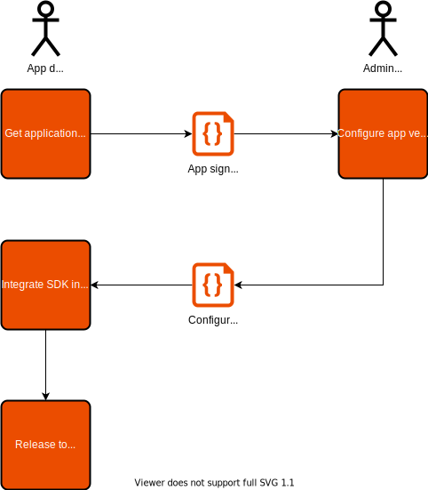
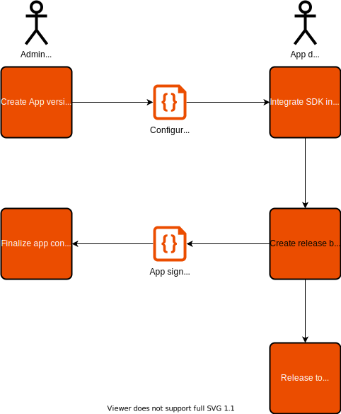

# Mobile application delivery lifecycle

The configuration and deployment of a new application release is a process where both the application developer and the administrator of the
Onegini Access are involved. To enable an application using the SDK to communicate with the Onegini Access, it has to be configured in the
Onegini Access. Therefore, the application developer should know which configuration settings to use in the application that they are building. To
simplify things for the application developer, the Onegini Access administrator can prepare and export the application configuration in the
Onegini Access. This configuration is exported as a zip archive which can be used in the

[SDK tooling](https://docs.onegini.com/sdk-configurator) to generate the required code and config files.

## Process

The order of the configuration depends on the version of the Onegini SDK and what they expect as application signature. Check the documentation of the specific
Onegini SDK version what is expected as signature. Application signatures are sometimes referred to as Application thumbprints or Application secrets.

### Application signature obtained up front

The most recent versions of the Onegini SDKs use an application signature that can be obtained before the app is built. For the Android SDK it is based on the
signing certificate. For the iOS SDK, the Application secret is equal to the App ID.

Android SDK: use the Google Play Store Console or `keytool` to get the SHA-256 fingerprint of your signing certificate. When you roll the signing key, you need
to provide all fingerprints for this app version.

iOS SDK: get the [App ID](https://help.apple.com/xcode/mac/current/#/dev618af4e67).
Example: `ABCDE12345.com.company.app`

1. Configure the app version in the Onegini Access with the provided value(s).
2. Export the app version
3. Use the configurator to inject the config
4. Build your app and sign it using the selected signing certificate

### Application signature calculated from the app binary

Previous versions of the Onegini SDKs require the final app build to calculate its signature.

1. Configure the app version in the Onegini Access with a dummy application signature
2. Export the app version
3. Use the Onegini SDK configurator to inject the configuration into the app
4. Build a release of the app
5. Use the Onegini calculator to get the actual signature
6. Configure the actual signature in the Onegini Access

#### Application signature during development

Once the application developer has received the application configuration archive, a test build can be made using the Onegini SDK. As the final application
signatures for this build are not configured, the application can only be used when the validation of the application signatures is disabled. When using Android
SDK 11 and up or iOS SDK 10 and up, change the [integrity level](../app-configuration/app-version-management.md) to "None" for this application version to skip
the validation of the signature. For older Onegini SDK versions, [enable development mode](../app-configuration/app-configuration.md#enabling-development-mode)
for the entire mobile application to skip the validation. Do not enable development mode on a production environment.

Bypassing the validation of the application signature enables functional testing of the application without configuring the correct application signature for
each individual build. Once testing and development are completed, the final release can be built. At this moment the application developer will need to
generate the application signature based on the release version of the application. Please note, that each small change in the application binary will have
impact on the application signature. So an application signature has to be generated for each version of the application. This will slow down development. More
details about using the SDK can be found in the platform specific [SDK documentation](https://docs.onegini.com/onegini-sdk.html).

#### Production ready application signature

The Onegini Access administrator is responsible for the last step in the flow. The configuration of the application signature of the release version of
the application. This Application signature must be sent to the Onegini Access administrator via a secure channel as this is very sensitive information.
The integrity level must be set to "Full" and development mode must be disabled when the proper application signature is configured for this specific
application version. The application should now be able to communicate securely with both the Onegini Access and resource gateway.

## Application version configuration

A Onegini Access admin can export the application config via the export button next to an application version in
the [application view](../app-configuration/app-configuration.md) or via
the [application version API](../../../api-reference/config-api/applications/application-version-api.md). The export is a zip file, that contains all required
information for the SDK. The Onegini Access administrator is responsible for shipping the zip archive to the application developer.

The exported zip file contains multiple elements. The paragraphs below explain the elements within the zip archive.

### Certificates

The SDK provides functionality to verify your servers' TLS certificate or its certificate chain. This is called certificate pinning. When you pin the servers'
certificate itself, you will need to release a new version of the application in the app store when you change the servers' certificate. The best alternative is
to use the intermediate certificate of the Certificate Authority used to get the server certificate (the second level in the certificate chain). Intermediate
certificate are usually valid for a longer period than server certificates. This gives you the option to renew the certificate of your own server without having
to deploy a new version of the application.

Make sure certificates for both the Onegini Access and your resource gateway are linked to an application via the configuration. When the
Onegini Access and resource gateway are both exposed on the same domain and therefore use the same certificate you only need to configure a single
certificate.

You can attach a certificate to an application when editing or creating the application configuration in the admin console. In the certificates section you can
select the certificates you have previously uploaded. Check the [certificates section](../../../appendix/administration/oauth-config.md#certificates) for
instructions to upload certificates.

### Onegini Access base URI

Onegini Access base URI is the URI all requests towards Onegini Access start with. Typically, this is the host name of Onegini Access. This value can be
configured via the admin console in System &rightarrow; General &rightarrow; Engine base urls.

### Resource gateway

To enable the SDK to perform resource calls, the Onegini SDK requires a base uri for its resource gateway. The resource gateway is an Oauth Client itself and
has to be configured as API client that can do Token Introspection in the Onegini Access admin console. The details on how to create and configure a
resource gateway can be found in the [resource gateway topic](../../general-app-config/resource-gateway/resource-gateway.md). Once a resource gateway is
selected for an application, its public base uri will be used in the SDK configuration archive.

### Application version details

An application should be able to identify itself towards the Onegini Access. This is done by sending the application version, platform and identifier. The
application configuration archive will contain all these details. This makes the archive specific for the platform, application and version.

### Redirect URL

This is the primary URL to which the end-users are redirected after they have successfully logged in. The `additional redirect URLs` are not exported. See
the [App Configuration](../app-configuration/app-configuration.md#creating-a-new-application)
in order to change the redirect URL for an already deployed application. Since the redirect URL is set globally for the application, you may run into problems
when building old application versions that rely on the old redirect URL. This is a known limitation of the version export.
