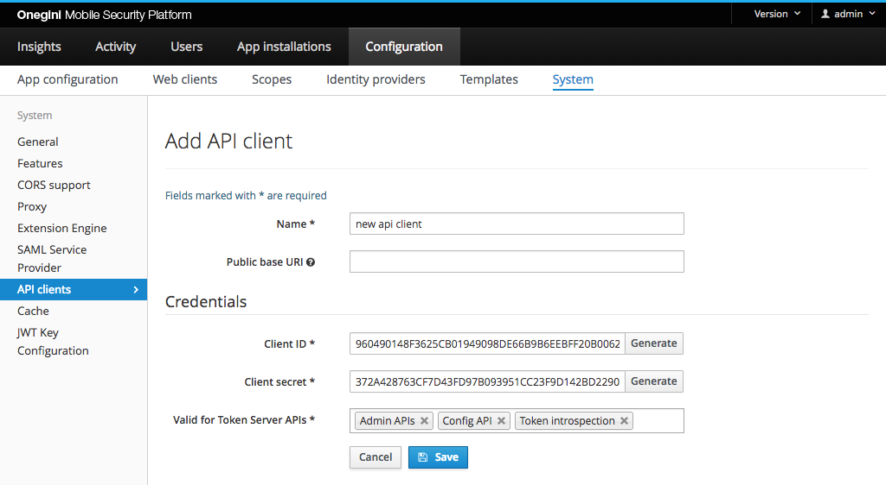

# API configuration

## Configure API access

Onegini Access offers several APIs to integrate Onegini Access  processes with existing systems. Access to the APIs can be managed via API clients. 
For every API client we need to configure client ID and his [authentication method](../../authentication-methods/authentication-methods.md). For now only client secret basic and private key JWT are supported.

The API clients can be configured in the admin console: Configuration &rightarrow; System &rightarrow; API clients. 

Per API client can be specified which API(s) can be accessed. This gives the opportunity to provide external systems using Onegini Access APIs only access to 
a certain function. Currently, access can be granted to the following APIs:

- [Admin API](../../../api-reference/admin-api/index.md)
- [Config API](../../../api-reference/config-api/index.md)
- [End user](../../../api-reference/end-user/index.md)
- [Events API](../../../api-reference/events-api/index.md)
- Insights: communication between Onegini Insights and Onegini Access to retrieve statistics data.
- [Mobile authentication](../../../api-reference/mobile-authentication/index.md)
- Payload encryption policy: communication between the Onegini Security Proxy and Onegini Access to exchange payload encryption settings.
- [Token introspection](../../../api-reference/token-introspection.md)
- User registration: [Custom Registration](../../../topics/custom-registration/index.md)
